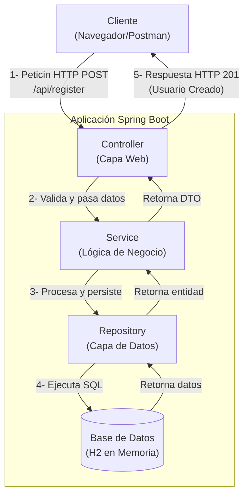

# API de Registro de Usuarios - Evaluación Java

API RESTful para el registro de usuarios. La aplicación está desarrollada con Spring Boot 3

---

## Tecnologías Utilizadas

*   **Lenguaje:** Java 17
*   **Framework:** Spring Boot 3.3.1
*   **Persistencia:** Spring Data JPA / Hibernate
*   **Base de Datos:** H2 (Base de datos en memoria)
*   **Seguridad:** Spring Security (para hasheo de contraseñas) y JSON Web Tokens (JWT)
*   **Validación:** Jakarta Bean Validation (con validadores personalizados)
*   **Documentación:** SpringDoc (Swagger UI)
*   **Build Tool:** Maven
*   **Pruebas:** JUnit 5 y Mockito

---

## Características Implementadas

*   **Endpoint de Registro:** `POST /api/register` para crear nuevos usuarios.
*   **Validación de Datos:**
    *   Formato de email y contraseña (configurable vía `application.properties`).
    *   Campos no nulos.
*   **Manejo de Errores Profesional:**
    *   `400 Bad Request` para datos de entrada inválidos.
    *   `409 Conflict` si el correo electrónico ya está registrado.
*   **Seguridad:**
    *   Las contraseñas se almacenan hasheadas con BCrypt.
    *   Se genera un token JWT único en cada registro exitoso y se persiste.
*   **Pruebas Unitarias:** Pruebas para la capa de servicio que cubren los casos de éxito y de error.
*   **Documentación de API:** Documentación interactiva disponible a través de Swagger UI.

---

## Cómo Ejecutar y Probar la Aplicación

### Prerrequisitos

*   Java JDK 17 o superior (idealmente usar 17).
*   Apache Maven 3.8 o superior.

### Pasos para la Ejecución

1.  **Clonar el repositorio:**
    ```bash
    git clone https://github.com/chrisneiil/registro-de-usuarios-api.git
    ```

2.  **Ejecutar con Maven:**
    Desde la raíz del proyecto, ejecuta el siguiente comando:
    ```bash
    mvn spring-boot:run
    ```
    La aplicación se iniciará en `http://localhost:8082`, puedes configurarlo en el archivo application.properties.

### Cómo Probar la API

Una vez que la aplicación esté en ejecución, puedes probarla de las siguientes maneras:

#### 1. Usando Swagger UI

*   Abre tu navegador y ve a: `http://localhost:8082/swagger-ui.html`
*   Expande el endpoint `POST /api/register`.
*   Haz clic en "Try it out", modifica el JSON de ejemplo y haz clic en "Execute".

#### 2. Usando cURL

Puedes usar la siguiente plantilla de `curl` en tu terminal para enviar una petición de registro:

```bash
curl -X POST http://localhost:8082/api/register \
-H "Content-Type: application/json" \
-d '{
  "name": "Test User Curl",
  "email": "curl-user@example.com",
  "password": "Password123",
  "phones": [
    {
      "number": "12345678",
      "citycode": "1",
      "contrycode": "57"
    }
  ]
}'
 ```

#### 3. Diagrama de la solucion


---

## Futuras Mejoras y Posibles Endpoints

La arquitectura actual de la aplicación está preparada para ser extendida fácilmente con funcionalidades adicionales, como un CRUD completo para la gestión de usuarios. Algunos de los endpoints que se podrían implementar son:

*   `GET /api/users`: Para obtener un listado de todos los usuarios.
*   `GET /api/users/{id}`: Para obtener los detalles de un usuario específico.
*   `PUT /api/users/{id}`: Para actualizar la información de un usuario.
*   `DELETE /api/users/{id}`: Para desactivar o eliminar un usuario.

Estos endpoints requerirían protección mediante el token JWT generado en el registro para asegurar que solo usuarios autorizados puedan acceder a ellos.